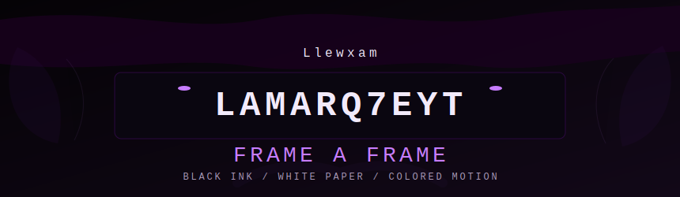

<p align="center">
  
</p>

<p align="center">
  <a href="https://github.com/Lamarq7eYT?tab=followers">
    
  </a>
  <a href="https://github.com/Lamarq7eYT?tab=repositories">
    
  </a>
  <a href="https://github.com/Lamarq7eYT?tab=repositories">
    
  </a>
  
</p>

<p align="center">
  
</p>

<p align="center">
  
</p>

---

## Identity

```ts
const llew = {
  github: "Lamarq7eYT",
  theme: "ink animation",
  role: "Full-Stack Developer",
  languages: [
    "Python",
    "JavaScript",
    "TypeScript",
    "Java",
    "C++",
    "C#",
    "Rust",
    "PHP",
    "Lua",
    "Assembly",
  ],
  web: ["HTML5", "CSS3", "Node.js", "major JS/TS frameworks"],
  data: ["SQL", "PostgreSQL", "MySQL", "SQLite", "SQL Server"],
  tools: ["Docker", "Git", "GitHub CLI", "Linux", "VS Code", "Visual Studio"],
  signature: "If you're going to see one of my works, be careful with your emotions",
};
```
To be honest, I really like TypeScript; the stack I use most often in your day-to-day work is TypeScript, so you'll see a lot of TypeScript here.

<p align="center">
  
</p>

## Featured Scenes

<p align="center">
  
</p>

<p align="center">
  <a href="https://github.com/Lamarq7eYT/AegisHub">
    
  </a>
  <a href="https://github.com/Lamarq7eYT/AegisCore">
    
  </a>
</p>

<p align="center">
  <a href="https://github.com/Lamarq7eYT/AegisHub/stargazers">
    
  </a>
  <a href="https://github.com/Lamarq7eYT/AegisCore/stargazers">
    
  </a>
  <a href="https://github.com/Lamarq7eYT/HackerPage/stargazers">
    
  </a>
</p>

<p align="center">
  
</p>

## Toolkit

### Languages

<p align="center">
  
</p>

### JavaScript and TypeScript Frameworks

<p align="center">
  
</p>

### Web, Data, Tools, Motion

<p align="center">
  
</p>

<p align="center">
  
</p>

## Stats Roll

<p align="center">
  
  
</p>

<p align="center">
  
</p>

<p align="center">
  
</p>

## Trophy Board

<p align="center">
  
</p>

<p align="center">
  
</p>

<p align="center">
  
</p>

## Activity Graph

<p align="center">
  
</p>

---

<p align="center">
  <a href="https://github.com/Lamarq7eYT?tab=repositories">Repositories</a> /
  <a href="https://github.com/Lamarq7eYT?tab=stars">Stars</a> /
  <a href="https://github.com/Lamarq7eYT?tab=followers">Followers</a>
</p>

<p align="center">
  
</p>